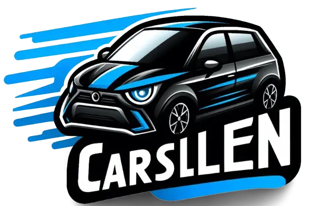

## Panel de administracion pagina MaxAutos

Panel de administracion de la aplicacion web [MaxAutos](https://maxautos.vercel.app/)

### Herramientas utilizadas
- **Next.js**: Framework de React para renderizado del lado del servidor y en el cliente.
- **NextAuth**: Biblioteca de autenticación para aplicaciones web Next.js
- **Tailwind CSS**: Framework de CSS utilitario para diseñar interfaces de usuario rápidamente.
- **TypeScript**: superconjunto de JavaScript que añade tipado estático.
- **Firebase**: Servicio de almacenamiento de objetos potente, simple y rentable para almacenamiento de imagenes

